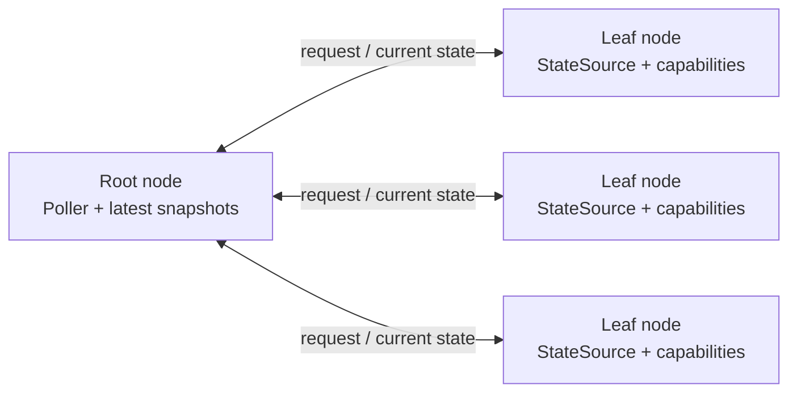

# Reference message flow

The root asks for disposable current state. A response replaces its cached
view. A timeout changes nothing.

```mermaid
sequenceDiagram
    participant R as Root Poller
    participant N as Tailscale
    participant L as Leaf StateSource

    loop Every poll interval
        R->>N: state_request(reply_to, reference)
        alt Leaf reachable
            N->>L: state_request
            L->>N: state_response(reference, current_state)
            N->>R: state_response
            R->>R: Replace cached leaf snapshot
        else Request or reply lost
            R->>R: Timeout; retain prior snapshot
        end
    end
```


